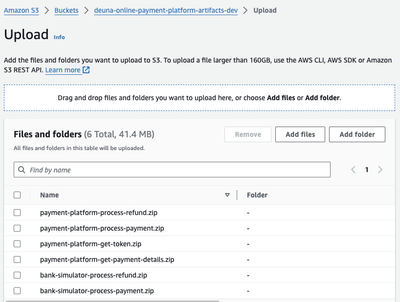
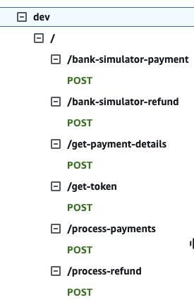

# OnlinePaymentPlatform
With the rapid expansion of e-commerce, there is a pressing need for an efficient payment gateway. This project aims to develop an online payment platform, which will be an API-based application enabling e-commerce businesses to securely and seamlessly process transactions.

# Considerations:

## Execution of the Solution:

### Provide clear instructions for setting up and running the online payment platform API.

- Built With:
  - Golang as development language
  - AWS as Cloud Platform (using Lambda, APIGateway, DynamoDB and Cloudwatch)
  - This project uses <a href="https://github.com/ulid/spec" target=on_blank>ULID</a>  as a unique identifier for transactions.
- Setup Instructions:
  - Install Golang and set up the development environment.
  - Navigate to the project directory and run `go mod tidy` to install the project dependencies.
  - Run `GOOS=linux GOARCH=amd64 go build -o bootstrap` in each folder to build the assets for Lambdas (excluding `helpers`).
  - Zip each built asset and name it like shown in the next image.

  - Deploy the template `/cloudformation/online-payment-platform-01-storage.yaml` using the AWS CLI or AWS Console.
  - Upload the built assets to the S3 bucket created by the CloudFormation stack.
  - Deploy the template `/cloudformation/online-payment-platform-02-lambdas.yaml` using the AWS CLI or AWS Console.
  - Deploy the template `/cloudformation/online-payment-platform-03-api.yaml` using the AWS CLI or AWS Console.
  - Deploy the template `/cloudformation/online-payment-platform-04-dynamodb.yaml` using the AWS CLI or AWS Console.
  - The API Gateway will be created like shown in the next image.
  
  
- Running the Application:
  - Once the API Gateway is created, you can use the provided endpoints to process transactions, query transactions, and refund transactions.
  - Use the provided API documentation [apidoc.yaml](apidoc.yaml) to understand the request and response formats for each endpoint.
  - Monitor the application's logs and metrics in CloudWatch to ensure it's running smoothly.
  - Use the DynamoDB console to view and manage the transaction and merchant data.
  
### Specify any dependencies or prerequisites for the solution.

- Prerequisites:
  - AWS Account with necessary permissions
  - AWS CLI installed and configured
  - Golang installed
  - Go modules for dependency management
## Assumptions:
### Clarify any assumptions made during the design and implementation.

- Assumptions:
  - The payment platform will be used by e-commerce businesses to process transactions.
  - The platform will handle payment processing, transaction queries, and refund transactions.
  - The platform will be integrated with a payment gateway for processing payments.
  - The platform will be designed to handle real-time transactions and ensure high availability and security.

## Areas for Improvement:

- Areas for Improvement:
  - Implementing a more robust authentication and authorization mechanism, such as OAuth or JWT, to enhance security.
  - Adding support for multiple payment gateways to provide flexibility to e-commerce businesses.
  - Enhancing the error handling and logging to improve the platform's reliability and troubleshooting capabilities.
  - Implementing a more comprehensive testing strategy, including unit tests, integration tests, and load testing, to ensure the platform's stability and performance.
  - Integrating with a monitoring and alerting system to provide real-time visibility into the platform's health and performance.
  - Encrypting sensitive data at rest and in transit to ensure data security and compliance with privacy regulations.
  - Implementing a idempotency mechanism to prevent duplicate transactions and ensure data consistency.

### Identify potential areas for improvement in the online payment platform.

### Discuss any design decisions or trade-offs made during development.

# Justification for Using Cloud Technologies in the Payment Platform

## Overview

This document justifies the choice of Amazon Web Services (AWS) as the cloud provider for developing an online payment platform, focusing specifically on the use of AWS Lambda, Amazon API Gateway, and Amazon DynamoDB. These technologies were selected for their ability to offer scalability, high availability, security, and an event-driven architecture that's ideal for processing real-time transactions.

## Cloud Technologies Used

### AWS Lambda

AWS Lambda is a compute service that runs code in response to events and automatically manages the compute resources.

**Justification**:

- **Automatic Scaling**: Lambda automatically adjusts its compute capacity to handle the incoming event volume, ensuring the payment platform can manage load spikes without manual intervention.
- **Cost-Effectiveness**: With Lambda, we pay only for the compute time we consume, significantly reducing operational costs by eliminating the need to provision or maintain servers.
- **Agile Development**: It enables rapid and agile development, as we can focus on writing code to process payments without worrying about infrastructure management.

### Amazon API Gateway

Amazon API Gateway is a fully managed service that makes it easy to create, publish, maintain, monitor, and secure APIs at any scale.

**Justification**:

- **Integration with AWS Lambda**: API Gateway seamlessly integrates with Lambda to expose our functions as RESTful or HTTP APIs, facilitating payment processing and transaction queries via HTTP.
- **Security and Monitoring**: Offers key features like API authentication and authorization, rate limiting, and API tracking, enhancing the security and visibility of our payment platform.
- **High Availability**: Ensures high availability for our APIs, essential for keeping the payment platform accessible at all times.

### Amazon DynamoDB

Amazon DynamoDB is a fast and flexible NoSQL database service for any scale.

**Justification**:

- **Performance and Scalability**: DynamoDB automatically handles request traffic to scale up or down to any request volume and ensure consistent performance, crucial for storing payment transactions and real-time queries.
- **Flexible Data Model**: Its NoSQL data model allows for easy adaptation to the payment platform's requirements, such as transactions storage, without needing a fixed schema.
- **Durability and Backup**: Offers automatic durability and backup, ensuring that critical transaction data is safe and easily recoverable in case of failures.

## Conclusion

The combination of AWS Lambda, Amazon API Gateway, and Amazon DynamoDB provides a solid and flexible foundation for developing an online payment platform. This architecture not only meets the requirements for scalability, availability, and security but also optimizes costs and accelerates the development cycle, allowing us to focus on creating an exceptional user experience and innovative functionalities for our customers.

# Authentication and Security:

The project uses the management of a single token, although due to lack of time it was left pending to add the validation of the merchant's APIKey. Two possibilities were considered for this case, one of them is Cognito and the other is the use of JWT

# Audit Trail:

The project uses CloudWatch as an audit trail, it could be combined with logging to files stored in S3. This CloudWatch/files could be used to generate reports and analysis of the transactions.